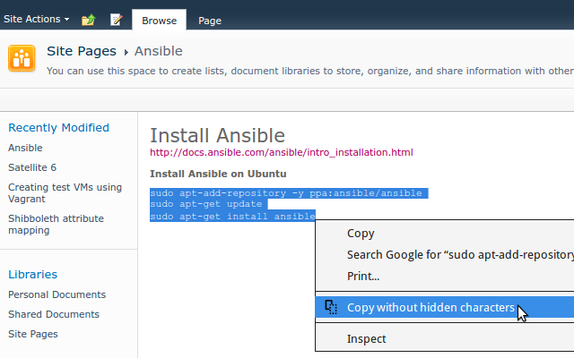

Chrome extension to copy text without hidden characters.

Some sites (\*cough\* Sharepoint \*cough\*) add hidden characters such as zero-width spaces that break commands when pasting them. This extension adds a new context menu option to copy without including those characters.

Screenshot:  

